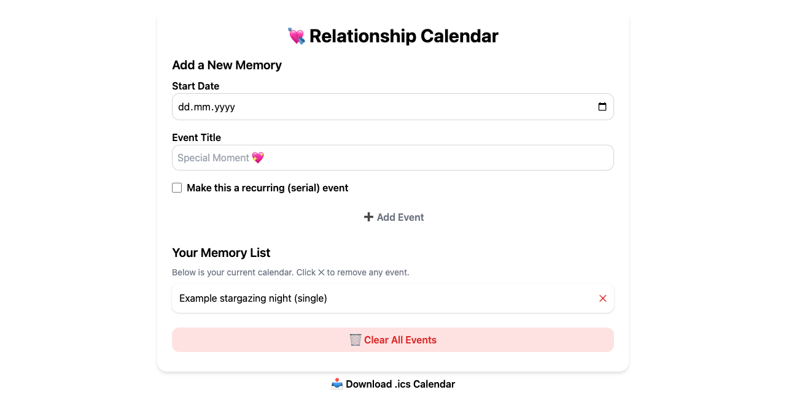
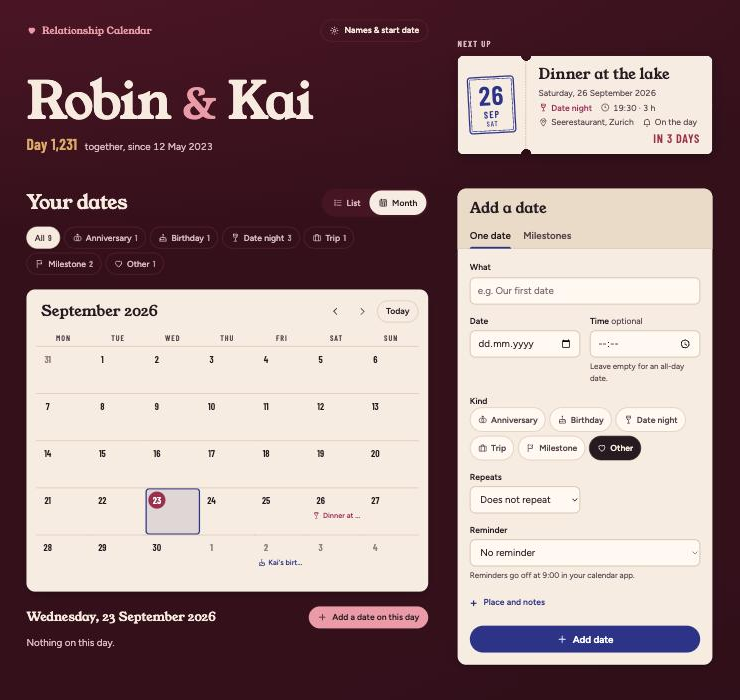
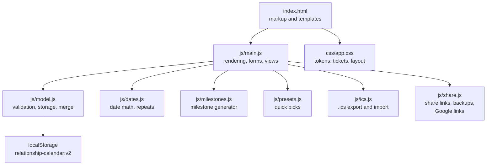

# Relationship Calendar

A small calendar for couples. It keeps your anniversaries, birthdays, date
nights, trips and relationship milestones in one place, shows what comes next
and how many days you have been together, and hands the dates to the calendar
apps you already use. There is no account and no database: everything stays in
your browser until you export or share it. The one exception is "Add to my
calendar" on iPhone, which sends the dates through the site's own
`/calendar.ics` function and straight back (see below).

**Live:** <https://calendar.bissbert.ch>





The screenshots use the fictional couple Robin & Kai.

## What it does

| Feature | Details |
|---|---|
| First-run setup | A new calendar starts with three short steps: your names, the day you got together, and the dates you already know (anniversary, birthdays, first date, Valentine's Day …), plus tick boxes for common milestones: 1 month, 3 months, 100 days, 6 months, 500 days and 1,000 days. Skippable, and skipped automatically when you arrive from a share link. |
| Upcoming dates | The next date as a large ticket, then every upcoming date grouped by month with "in 12 days" style countdowns. Past dates fold away behind a toggle. |
| Month view | A keyboard-navigable month grid (arrow keys, Home/End, Page Up/Down, Shift+Page for years). Selecting a day lists its dates and offers to add one there. |
| Together counter | Enter the day you got together and the header shows "Day N". |
| Milestones | Generates monthiversaries, day counts (100, 500, 1000 …), numbered anniversaries and optional fun numbers (1111, 1234 …) from your start date, with a preview before adding. |
| Quick picks | One tap fills in dates most couples keep: your anniversary (from your start date), each partner's birthday, your first date, a weekly Friday date night at 19:00, Valentine's Day and the day you moved in. Each comes with its usual repeat and reminder. A pick disappears once a date with that name exists. |
| Rich dates | Kind (anniversary, birthday, date night, trip, milestone, other), optional time and duration, place, notes, repeats (weekly, monthly, yearly, with an optional end) and a reminder. |
| Edit, delete and undo | Every ticket has labelled Edit and Delete buttons, and the edit form has "Delete this date". "Start over" removes all dates after an in-place confirmation that names the count. Every change shows a toast with **Undo** that waits while you point at it. |
| Calendar export | A standards-compliant `.ics` file: all-day or timed events, `RRULE` repeats, `VALARM` reminders and stable UIDs, so importing again updates dates instead of duplicating them. |
| Add to my calendar | On phones, one button hands the `.ics` file to the device calendar: iOS opens its "Add All" calendar sheet (the dates go to `/calendar.ics`, a Pages Function that rebuilds the file and stores nothing, because iOS won't open calendar files from `data:` or `blob:` URLs), Android opens the share sheet to pick a calendar app, and anything else falls back to a download. The calendar app always asks before adding. |
| Google Calendar | Each date has a link that opens it prefilled in Google Calendar. |
| Share with your partner | A link that carries your dates in the URL fragment. The fragment never reaches the server; an empty calendar loads the dates straight away; otherwise a dialog offers to add them next to yours or replace yours, with Undo either way. |
| Backup and import | Download a JSON backup and restore it later, or import any `.ics` file from another calendar. |

Dates from the first version of the app (stored under `relationshipEvents`)
are migrated automatically on first load.

## Run it locally

There is no build step and nothing to install:

```sh
python3 -m http.server 8000
```

Open <http://localhost:8000>. The page uses ES modules, so it has to be served
over HTTP; opening `index.html` as a file does not work. The static server
doesn't run `functions/`; to try `/calendar.ics`, build and run
`wrangler pages dev dist` instead.

Run the tests with Node 22 or newer (the share-link tests need `CompressionStream("deflate-raw")`):

```sh
node --test tests/*.test.mjs
```

## Deploy

The site is hosted on Cloudflare Pages as a direct upload. `tools/build-dist.sh`
copies only the served files into `dist/`, which keeps the README, docs, tests
and tooling off the public site. Run the deploy from the repo root so wrangler
also picks up `functions/`:

```sh
tools/build-dist.sh
wrangler pages deploy dist --project-name relationship-calendar --branch main
```

`_headers` sets a strict Content Security Policy (scripts, styles and fonts
from the same origin only, no inline code), HSTS and the usual hardening
headers. The custom domain is attached to the Pages project in the Cloudflare
dashboard.

## Architecture



Dates are plain `YYYY-MM-DD` strings and all arithmetic runs on UTC midnights,
so no time zone can move an anniversary by a day. The DOM is built with
`createElement` and `textContent` only; nothing user-supplied goes through
`innerHTML`.

More detail is in [`docs/`](docs/README.md).

## Repository layout

```text
index.html      page markup and the SVG icon sprite
css/app.css     design tokens and all styles
js/             ES modules (see the architecture diagram)
fonts/          self-hosted Young Serif, Figtree, Barlow Condensed + OFL licenses
_headers        Cloudflare Pages security headers
tests/          node:test suite for dates, model, milestones, .ics and sharing
tools/          dist build, measurement and Linux check scripts
media/          screenshots from a real local run
docs/           subsystem write-ups
PRODUCT.md      product context used for design work
DESIGN.md       the visual system
```

## Limits

- Data lives in one browser. Use the share link or a backup to move it to
  another device; there is no automatic sync.
- A share link with many long notes can grow past 8,000 characters, which some
  messengers truncate. The app warns when that happens and suggests a backup
  file instead.
- `.ics` import keeps weekly, monthly and yearly repeats. More complex rules
  (every other week, specific weekdays) are imported as single dates, and the
  app says how many were simplified.
