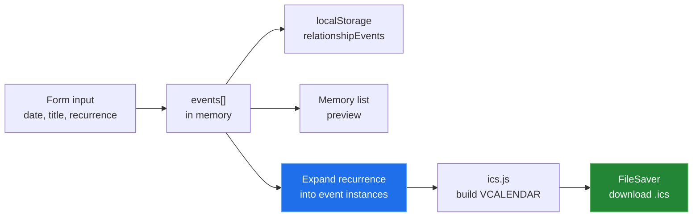
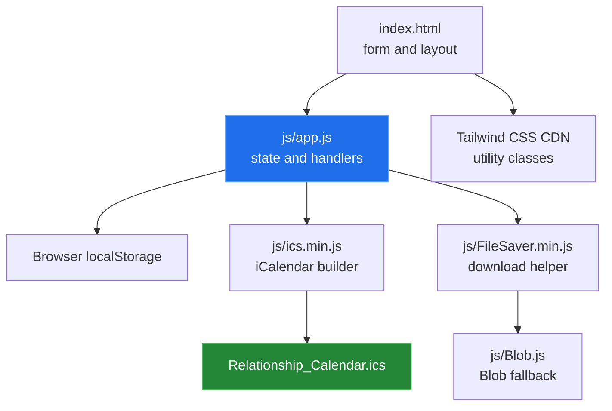

# Relationship Calendar

Relationship Calendar is a small browser-only calendar for couples who want to
collect shared memories and export them as an `.ics` file. It runs as a static
GitHub Pages site, keeps the working list in the browser's local storage, and
does not need an account or a server-side API.


The screenshot is a real local run with the fictional event title
`Example stargazing night`.

## Quick start

The app has no build step or package installation:

```sh
cd relationship-calendar
python3 -m http.server 8000
```

Open <http://localhost:8000> in a browser. The static-server command and the
local page load were verified in this checkout.

### Deploy to GitHub Pages

The repository already contains the site entry point at `index.html`. In the
repository's GitHub settings, choose **Pages**, select **Deploy from a branch**,
choose `main` and the `/ (root)` folder, then save. Pages can serve the files
directly because there is no build command or generated output directory.

## Generation flow

The form stores event entries first. Export expands recurring entries into
individual calendar events and passes them to the vendored `ics.js` library.



## Architecture



## Capabilities

| Capability | Current behavior | Main source |
|---|---|---|
| Single memories | Adds one event entry to the preview list. | `index.html`, `js/app.js` |
| Linear recurrence | Offers weekly, monthly, or yearly intervals and an end date. | `index.html`, `js/app.js` |
| Exponential recurrence | Expands through the built-in weekly, monthly, and yearly stages. | `js/app.js` |
| Local persistence | Saves the event list under `relationshipEvents` in local storage. | `js/app.js` |
| Calendar export | Builds iCalendar events and downloads `Relationship_Calendar.ics`. | `js/app.js`, `js/ics.min.js` |
| Static hosting | Loads from the repository root with no build tool. | `index.html` |

## Measured results

| Check | Result | How it was obtained |
|---|---:|---|
| Local static page load | passed | `python3 -m http.server 8000` and a real browser session |
| Fictional single-event add flow | passed | The event appeared in the rendered memory list |
| Browser errors during the verified single-event flow | none observed | Browser `errors` and `console` checks |
| Runtime files | 5 | `python3 tools/measure.py` |
| Runtime inventory | 977 lines, 37,297 bytes | `python3 tools/measure.py` |
| Example screenshot | 1,280 × 662 pixels, 50,415 bytes | `python3 tools/measure.py` |

The measurement procedure and the unverified paths are recorded in
[`docs/measurement.md`](docs/measurement.md).

## Repository layout

```text
index.html       static page, form, and layout
js/app.js        event state, recurrence, preview, and export wiring
js/ics.min.js    vendored iCalendar builder
js/FileSaver.min.js  vendored browser download helper
js/Blob.js       vendored Blob compatibility helper
tools/           standard-library measurement script
media/           screenshots captured from a real local browser run
docs/            subsystem write-ups and measurement provenance
```

## Known limitations

- The preview shows the title and recurrence label, not the date or the
  expanded instances. Inspect the downloaded calendar to see the generated
  dates.
- `localStorage` is browser- and origin-specific. Clearing site data or using
  another browser removes the visible working list from that browser.
- The page loads Tailwind CSS from jsDelivr, so the initial styling depends on
  network access to that CDN.
- The Pages setting itself was not inspected in this pass. The deployment
  instructions describe the repository's static root, not a measured Pages
  deployment.

Three defects recorded during this pass have since been fixed on the default
branch: recurring linear events could not be submitted because `js/app.js` read
a `linear-end` input the markup does not contain, the toast calls had no toast
elements to write into, and `index.html` closed a `</div>` early between the
action buttons. The handler now reads `recurring-end`, `index.html` carries
accessible toast elements and emits one notification per user action, and the
stray closing tag is gone. See [`docs/BUGS-FOUND.md`](docs/BUGS-FOUND.md).
