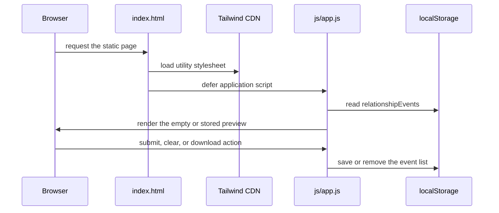

# Application shell

[← back to the overview](../README.md) · [documentation index](README.md)

`index.html` is the complete page shell. It provides the form for a start date
and title, an optional recurrence section, the memory preview, and the two
actions for clearing and downloading. Tailwind utility classes are loaded from
jsDelivr; the application itself is still just static HTML and JavaScript.

## Load and event wiring

## Controls

| Control | Role |
|---|---|
| Start Date | Base date for a new entry. |
| Event Title | Optional label; a default is selected when it is empty. |
| Serial checkbox | Reveals recurrence controls. |
| Pattern and interval | Selects linear or exponential recurrence behavior. |
| Memory list | Shows saved entries and exposes a remove action per entry. |
| Clear All Events | Removes the in-browser event list after confirmation. |
| Download `.ics` | Expands the entries and starts the calendar download. |

The page intentionally has no server-side session. The browser owns both the
working state and the export action.
