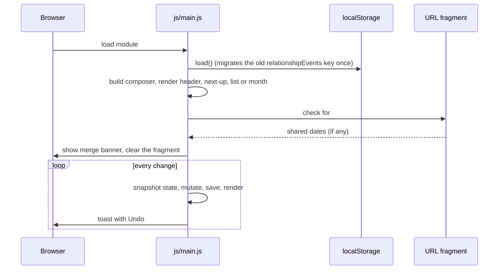

# Application shell

[← back to the overview](../README.md) · [documentation index](README.md)

`index.html` holds the static markup: the header with the couple's names, the
next-up ticket, the view tabs, the composer card, the takeaway section
(export, share, backup, import) and an inline SVG icon sprite. It loads one
stylesheet and one module, `js/main.js`, which imports the others. There are no
inline scripts or styles, which lets `_headers` ship a same-origin-only CSP.

## Start-up and rendering

All state lives in one object (`events` and `settings`). Every mutation goes
through `change(message, mutate)`, which snapshots the previous state, saves,
re-renders and shows a toast whose **Undo** restores the snapshot. A timer
re-renders after midnight so "today" and the day counter stay current when the
tab stays open.

The DOM is built with a small `el(tag, props, children)` helper that only sets
`textContent` and attributes, so titles, places and notes can never inject
markup.

## Views

| View | Behaviour |
|---|---|
| Upcoming | Next occurrence of every date, grouped by month, with kind filter chips when two or more kinds exist. Past one-off dates sit behind a "Show past dates" toggle. |
| Month | A `role="grid"` table with one roving-tabindex button per day. Arrow keys move by day and week, Home/End to the week's edges, Page Up/Down by month and Shift+Page Up/Down by year. The selected day's dates appear below with a shortcut to add one on that day. |

The chosen view is remembered in `localStorage` under
`relationship-calendar:view`.

## Composer

The composer card is the add and edit form. On wide screens it sits beside the
list and stays in view while scrolling; on phones it comes first, because
adding a date is the main thing people do. It has two tabs:

- **One date:** title, date, kind, optional time and duration, repeat and end
  date, reminder, place and notes. Hints explain edge cases, such as a monthly
  repeat on the 31st skipping short months.
- **Milestones:** pick sets (monthiversaries, day counts, anniversaries, fun
  numbers) and see a preview of the dates before adding them.

Validation errors are shown next to the field and focus moves to the first
invalid one. Editing a date fills the same form; cancelling returns focus to
that date's Edit button.
