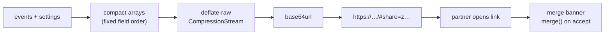

# Calendar export and sharing

[← back to the overview](../README.md) · [documentation index](README.md)

Nothing leaves the browser unless the user exports or shares it, and even then
no server is involved.

## `.ics` export

`js/ics.js` writes RFC 5545 text directly; no library is needed.

- All-day dates use `DTSTART;VALUE=DATE` with an exclusive `DTEND`.
- Timed dates use floating local time (`DTSTART:20260131T193000`), so a
  dinner at 19:30 stays at 19:30 wherever the file is opened and no
  `VTIMEZONE` block is needed.
- Repeats become `RRULE:FREQ=…` with `UNTIL` when an end date is set.
- Reminders become a `VALARM` that fires at 09:00 on the day, the day before
  or a week before (or at the start time, if that is earlier).
- UIDs are `<id>@relationship-calendar`, so importing the file again updates
  the existing entries instead of duplicating them.
- Text is escaped and lines are folded at 75 octets without splitting a UTF-8
  character.

## `.ics` import

`fromICS` reads files from other calendars. It unfolds lines, handles
`VALUE=DATE`, UTC and `TZID` start times, `DTEND` or `DURATION`, and maps
`RRULE` with `FREQ` of `WEEKLY`, `MONTHLY` or `YEARLY` (plus `UNTIL` or
`COUNT`). Rules the model cannot represent, such as `INTERVAL=2` or `BYDAY`,
are imported as a single date and counted, and entries without a date are
skipped and counted, so the user is told exactly what changed.

## Google Calendar links

Each ticket has a link to `calendar.google.com/calendar/render` with the
title, dates, place, notes and repeat rule prefilled. It opens in a new tab;
nothing is sent until the user saves it in Google Calendar.

## Calendar help

No browser API writes to a phone's calendar, so every device gets the same
`.ics` download. "How do I add it?" opens a dialog that explains what to do
with the file next. `calendarHelpPlatform` in `js/share.js` reads the user
agent and picks the steps it leads with:

| Platform | Detected by | Steps |
|---|---|---|
| `ios-safari` | iPhone, iPad or iPod (or a Mac UA with touch points, which is iPadOS) with `Safari/` and no other browser token | Downloads arrow in the address bar → tap the file → Add All |
| `ios-other` | iOS with `CriOS`, `FxiOS`, `EdgiOS`, `OPiOS` or `GSA`, or no `Safari/` at all (in-app browsers) | Save to Files → Files app → Downloads → tap the file → Add All |
| `android` | `Android` | Open the download → pick a calendar app that imports `.ics` (e.g. Samsung Calendar); Google Calendar on a phone can't, so the note points to the per-date Google links or the import on calendar.google.com |
| `desktop` | anything else | Open the file in Apple Calendar or Outlook, or import it on calendar.google.com |

The other platforms' steps sit in a "Using a different device?" disclosure in
the same dialog, so a wrong guess costs one tap.

## Share links

The data sits in the URL fragment, which browsers do not send to the server.
After the page reads it, it removes the fragment with `history.replaceState`
so a reload does not offer the same merge again. Links over 8,000 characters
still work but trigger a warning, since some chat apps cut long links.

## Backups

The backup is a JSON file named `relationship-calendar-backup-YYYY-MM-DD.json`
holding the events and settings. Importing it (or an `.ics` file, up to 5 MB)
merges with the current dates using the same rules as a share link.
