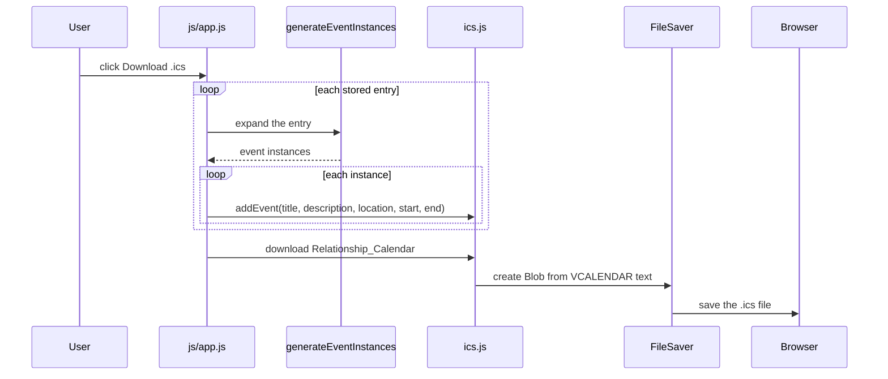

# Calendar export

[← back to the overview](../README.md) · [documentation index](README.md)

The download button does not send data to a server. It walks the current
`events` array, expands each entry, formats each start and end value, and hands
the resulting events to the vendored `ics.js` builder.

## Export sequence

Each generated instance uses the title, a description derived from that title,
the fixed location from the form handler, and a formatted local start/end pair.
The export library supplies the iCalendar envelope and the browser helper turns
it into a download.

## Vendored browser helpers

| File | Responsibility |
|---|---|
| `js/ics.min.js` | Builds the `VCALENDAR` and `VEVENT` text. |
| `js/FileSaver.min.js` | Requests a browser download from a Blob. |
| `js/Blob.js` | Provides compatibility support for Blob creation. |

The single-event path was exercised in a local browser session without a
reported browser error. The downloaded file's contents were not inspected in
this pass, so export correctness is documented from the source path rather than
reported as a measured result.
