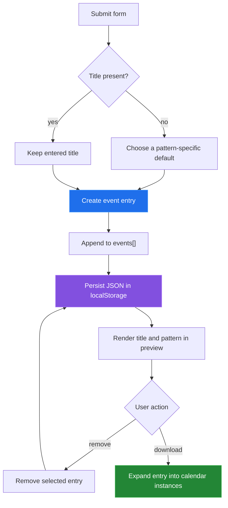

# Event model

[← back to the overview](../README.md) · [documentation index](README.md)

`js/app.js` keeps a JavaScript array named `events`. Each entry carries a title,
description, location, start date, and a pattern. Linear entries also carry an
interval and an end date; the exponential path uses the fixed staged schedule in
the source.

## From form to preview or export

## Recurrence paths

- `single` creates one instance from the base date.
- `linear` advances the current date by the selected interval until the end
  date.
- `exponential` advances through the fixed weekly, monthly, and yearly stages
  in `generateEventInstances`.

The preview does not expand these instances. It renders the entry's title,
pattern label, and (for linear entries) the stored end-date text.

## Persistence boundary

The serialized array is stored under `relationshipEvents`. Loading the page
reads that key and immediately repaints the preview. This is convenient for a
single browser, but it is not synchronization: another browser, device, or
origin has a separate store.

The current linear submit path has a source-level mismatch: the HTML field is
`recurring-end`, while the handler looks up `linear-end`. As a result, the
linear branch reads `.value` from `null` and the entry is not appended. The
overview lists this as a known limitation because this documentation pass does
not change behavior.
